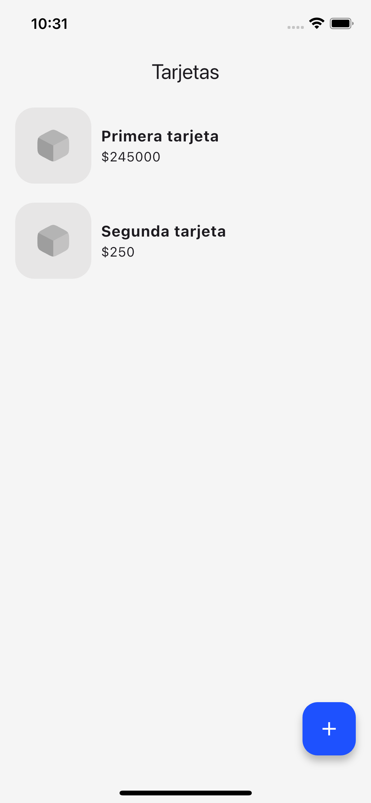
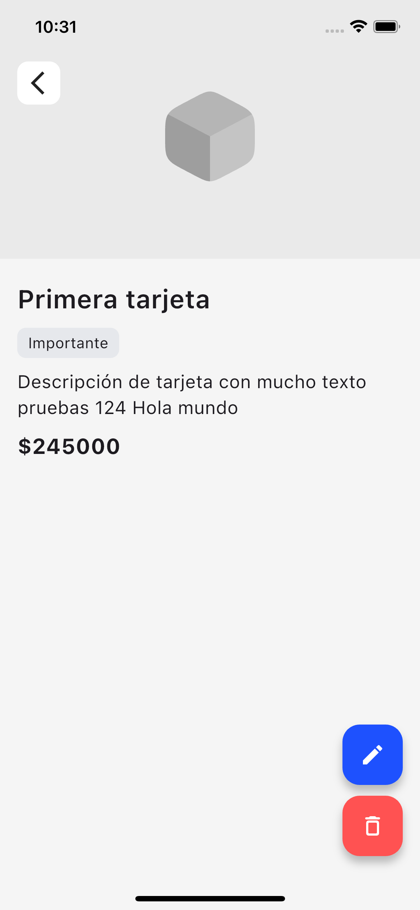
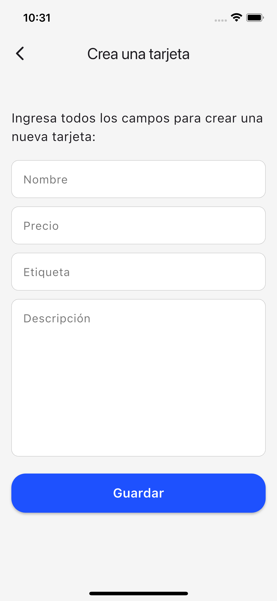
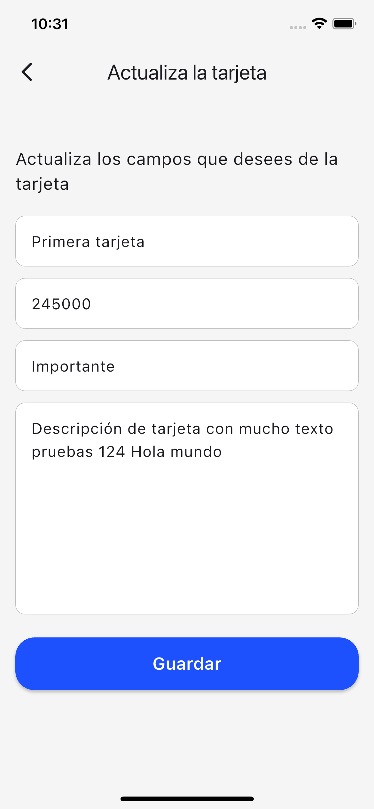

Este proyecto es una aplicación móvil desarrollada en Flutter que implementa Clean architecture. Utiliza Bloc para la gestión del estado y la inyección de dependencias para un código modular y mantenible.

## Tecnologías y herramientas

- **Flutter**: Framework para el desarrollo de aplicaciones móviles multiplataforma.
- **Bloc**: Patrón de gestión del estado.
- **Inyección de dependencias**: Para desacoplar módulos y mejorar la testabilidad.
- **Hive**: Para el almacenamiento de datos local.
- **Clean architecture**: Para organizar el código de manera modular y escalable.
- **Dart**: Lenguaje de programación utilizado en Flutter.

## Estructura del proyecto

```
lib/
    ├── core/               # Lógica compartida y configuración
    ├── features/           # Componentes de la aplicación
    ├── domain/             # Entidades, casos de uso y repositorios
    ├── infrastructure/     # Implementaciones de repositorios y fuentes de datos
    ├── presentation/       # UI y Bloc
    ├── shared/             # Componentes compartidos
    └── main.dart           # Punto de entrada de la aplicación
```

## Pantallas

### Cards List:



Muestra la lista de tarjetas creadas

### Detail Card:

<div style="display: flex; gap: 10px;">
   
</div>

Muestra el detalle de una tarjeta especifica con toda la información relevante.

### Create Card:



Muestra un formulario para crear una nueva tarjeta. Incluye campos para ingresar el nombre, precio, etiqueta y la descripción.

### Update Card:



Muestra un formulario para editar los datos de una tarjeta existente.

## Instalación

1. Clonar el repositorio:
   ```sh
   git clone git@github.com:Carl0395/cards_app.git
   ```

2. Navegar al directorio del proyecto:
   ```sh
   cd cards_app
   ```

3. Instalar dependencias:
   ```sh
   flutter pub get
   ```

## Ejecución

Para ejecutar la aplicación en un emulador o dispositivo físico:
```sh
flutter run
```
